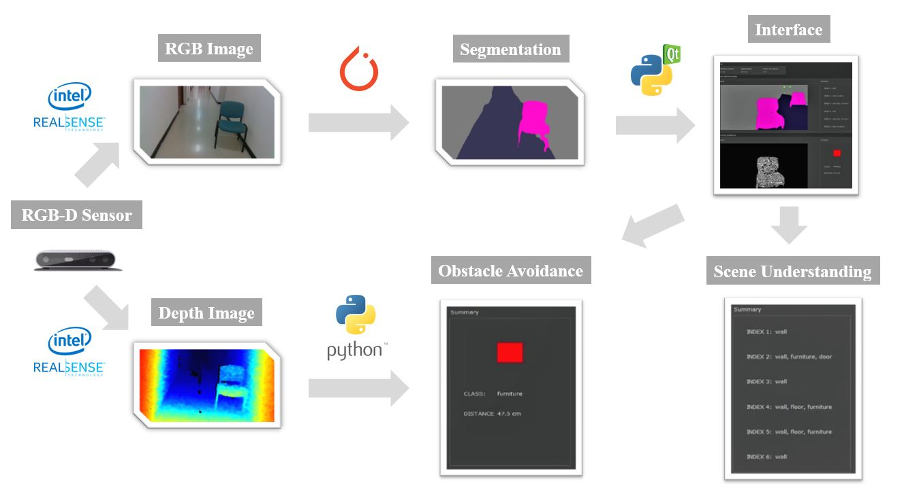
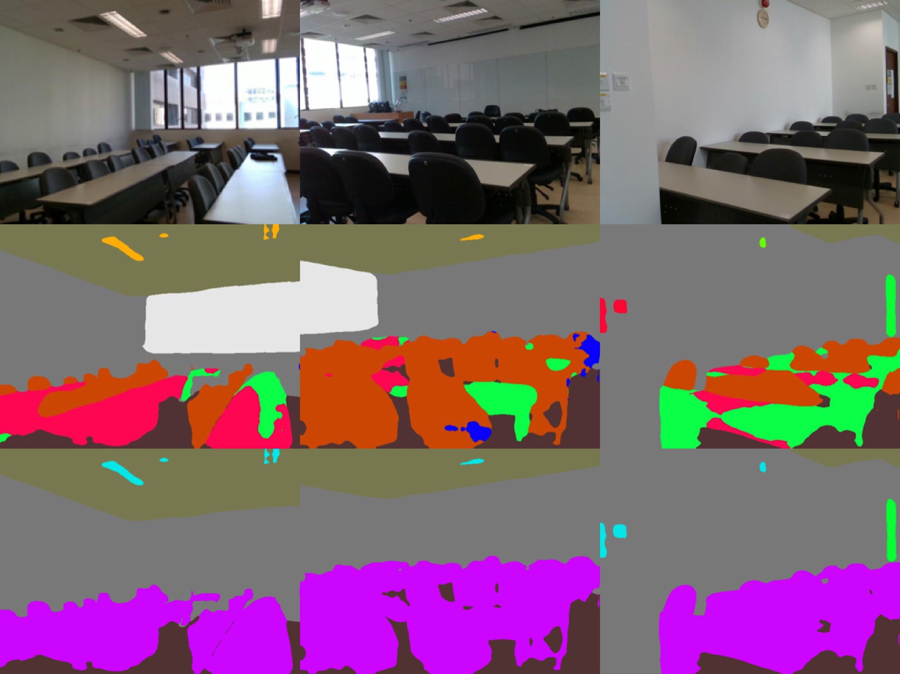
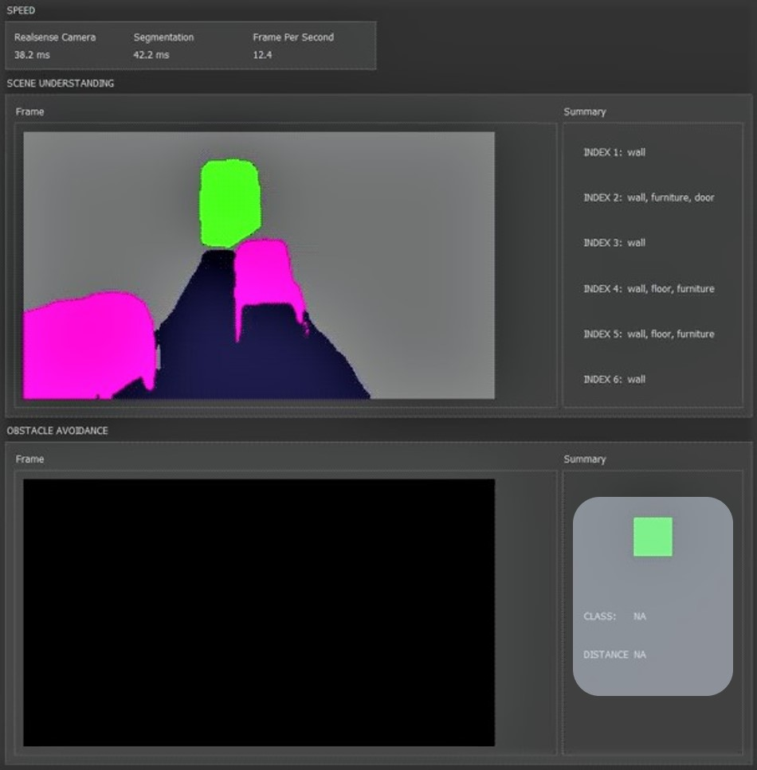
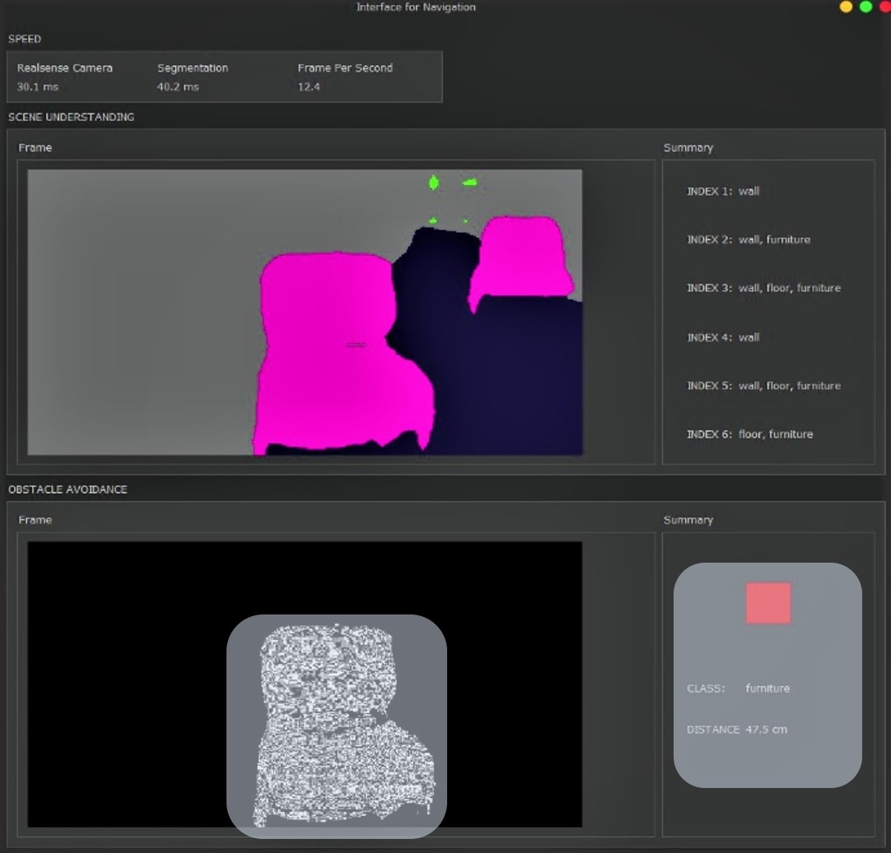

## About
  
In this capstone project, we developed a deep learning-based local navigation system for the visually impaired users. The system is prototyped in Python and it offers 3 special features:  
1. A state-of-the-art segmentation module that supports **low latency (around 20 FPS) with remarkable segmentation performance**
2. A **scene understanding module** for summarising spatial scene into grid of objects  
3. An **Obstacle avoidance module** for detection of closest obstacle  


## Hardware Specification  
To produce the statistics reported here, we use a notebook with the following specification:  
- NVIDIA RTX 2070 Max Q (8GB)
- Core i7-9750H CPU
- 230W AC Charger

We use [Intel Realsense D435i Camera](https://www.intelrealsense.com/depth-camera-d435i/) as our depth camera.

## Reproducing This Repo
For hardware, you need a Realsense camera and a notebook with discrete GPU. For Realsense camera, we recommend using [Realsense Camera D400 Series](https://www.mouser.com/new/intel/intel-realsense-camera-400/).  

Our repo mainly use the following libraries:  
- [Intel RealSense SDK 2.0](https://github.com/IntelRealSense/librealsense)
- pyrealsense 
- PyTorch (1.2.0)
- opencv (3.4.2)
- PyQt5
- numpy
- matplotlib

## Pipeline Diagram
The pipeline of our system can be summarized by the diagram below. It broken down into the following steps: 
1. Our system seamlessly receives RGB image and its depth image. We interfaces with D435i camera with ```pyrealsense2```. 
2. After image proprocessing, we feed the RGB image into **segmentation module**. The segmentation module is developed in ```PyTorch```.
3. Our interface consolidate the above output and feed them to **scene understanding module** and **obstacle avoidance module**. Additionally, the obstacle avoidance module requires depth image as input. Our interface  developed in ```PyQt5```. 



## Segmentation Module  
Our segmentation module is based on [semantic-segmentation-pytorch](https://github.com/CSAILVision/semantic-segmentation-pytorch). While the base model is fast enough, we made a number of modifications on the image preprocessing and postprocessing step to make the speed faster.  

The original model consists 150 classes. To smoothen the segmentation result, we group them into 8 general classes. The figure below illustrates the effectiveness of class grouping.  

*(First top to bottom: Original Images, Segmentation before Class Grouping, after Class Grouping)*




## Scene Understanding Module
To better help the visually blind user make sense of a scene, this module aims to translate and condense the visual information encoded in segmentation result. 

It divides the segmentation result into 6 equal grids and summarise the objects present for each grid. To remove noise, objects with little occupation in a grid are omitted.  

*(Left: Illustrating how segmentation result are divided. Right: Summary for each grid)*


## Obstacle Avoidance Module
This module informs the users if they are facing any close obstacles. A red light is on if any close obstacle is detected. Otherwise, green light is on. 

*(First Figure: No close obstacle detected by the module. Second Figure: Close obstacle detected with its class and distance)*




## Demonstration  
We prepared two videos to show case our system. 

The first demo shows the fast frame rate and the segmentation stability of our system. It also shows how our obstacle avoidance module works. When any close obstacle is right close to the user, red light is on with the corresponding obstacle visualized. 

*(Short demo video for our system)*


<br><br>

Our second demo is an experiment we conducted in a narrow corridor (located in Run Run Shaw Building, The University of Hong Kong). One of our teammate role played the blind and navigated in the corridor by solely relying on our system.

*(A snapshot of our demo in corridor, the full demo can be found on [Google Drive](https://drive.google.com/file/d/1XXBcXv-kllpN9k63bk1p5M5xWrsTEt2k/view?usp=sharing))*


## Acknowledgement  
This is my capstone project for my Master of Data Science degree in The University of Hong Kong. The project is jointly developed by Alex Lau, Guo Huimin and Xie Jun.  

We would like to take this chance to thank our two supervisors, Professor Yin Guoshen for his generous support and Dr. Luo Ping for his guidance on segmentation modules.

Our segmentation module is mainly built on [semantic-segmentation-pytorch](https://github.com/CSAILVision/semantic-segmentation-pytorch).
The work gives us a very strong baseline to make our system solid.


## License
To Be Filled