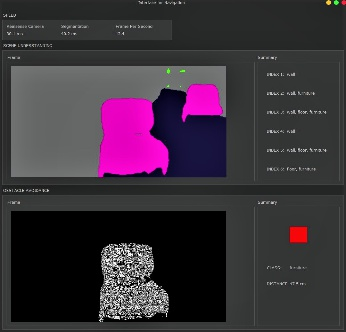

## About
<table>
<tr>
<td>
  
This is a capstone group project of my master degree. We developed a Deep learning-based local navigation system for the visually impaired users. The system is prototyped in Python and it offers 3 special features:  
1. A state-of-the-art segmentation model that supports **low latency (more than 20 FPS) with remarkable segmentation performance**
2. A **scene understanding module** for summarising spatial scene into grid of objects  
3. An **Obstacle avoidance module** for detection of closest obstacle  

(Interface Preview)

</td>
</tr>
</table>

## Summary

## Overview

# How to Install  

## Demonstration  

## Acknowledgement  

## References  

## Author of The Repository  
This repository is jointly developed by Alex Lau, Guo Huimin and Xie Jun.  

## License
